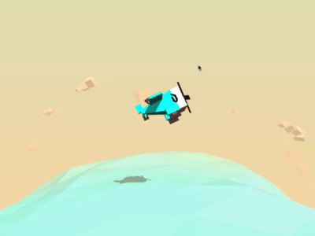

# Week 2 - WebGL

WebGL is a rasterization engine, enabling you to use the raw power of your GPU from javascript. It's mostly used to render pixels to an HTML canvas, and opens up the possibility to do 3D graphics rendering using web technologies.

## WebGL 2D - Fragment Shaders

We've prepared a video series going through the basics of vertex and fragment shaders. You can find the instructional videos on our learning platform.

You can find the solutions for these exercices in [the week02/2d folder](2d) of this repo.

## WebGL 3D - Three.js

Survived the WebGL 2D part? Let's add the 3rd dimension to our apps!

Doing 2D WebGL might have seemed a lot of work already, and things get a bit more complicated when we start adding the 3rd dimension. This is why we'll use [Three.js](https://threejs.org/) to abstract some of the math and shader stuff.

Three.js itself has some great [documentation](https://threejs.org/docs/index.html#manual/en/introduction/Creating-a-scene) and [an extensive list of examples](https://threejs.org/examples/).

To learn how to work with Three.js, we are going to go with the lesson series at https://threejsfundamentals.org/. We'll go through some of the pages there, before creating an interactive 3D WebGL experience.

### Hello Three.js

To be able to run of the Thee.js code, you'll need to link the Three.js library. Just use the CDN for now. And, as you're just experimenting and learning right now, you don't really need to go through the trouble of settings up a bundler / transpiler. Set your script tag as "module" and import threejs.module.js from either a CDN or a local download:

```javascript
<script type="module">
  import * as THREE from 'https://cdnjs.cloudflare.com/ajax/libs/three.js/r120/three.module.js';
</script>
```

You'll start by going through the page at https://threejsfundamentals.org/threejs/lessons/threejs-fundamentals.html where you'll build a basic Three.js scene, familiarizing yourself with some basic Three.js concepts.

Work your way through the following lessons:

- https://threejsfundamentals.org/threejs/lessons/threejs-responsive.html
- https://threejsfundamentals.org/threejs/lessons/threejs-primitives.html
- https://threejsfundamentals.org/threejs/lessons/threejs-scenegraph.html

Read up on materials at https://threejsfundamentals.org/threejs/lessons/threejs-materials.html

And continue coding with:

- https://threejsfundamentals.org/threejs/lessons/threejs-textures.html (up until Filtering and Mips)

After handling the basics of textures, read through the following pages, and check the live demos. No need to code these yourself, just get yourself familiar with the different types and options:

- https://threejsfundamentals.org/threejs/lessons/threejs-lights.html
- https://threejsfundamentals.org/threejs/lessons/threejs-cameras.html
- https://threejsfundamentals.org/threejs/lessons/threejs-shadows.html

### The Aviator

A fun tutorial, applying a lot of the content covered before, can be found at https://tympanus.net/codrops/2016/04/26/the-aviator-animating-basic-3d-scene-threejs/ - go through the tutorial, and try implementing it using ES6 code.



## Where to go from here

- http://math.hws.edu/graphicsbook/index.html
- https://github.com/sjfricke/awesome-webgl
- https://thebookofshaders.com/
- https://www.august.com.au/blog/animating-scenes-with-webgl-three-js
- https://tympanus.net/codrops/2017/05/09/infinite-tubes-with-three-js/
