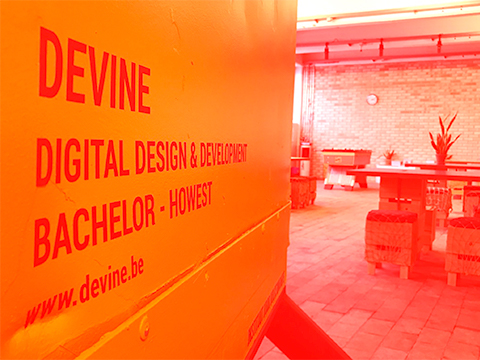
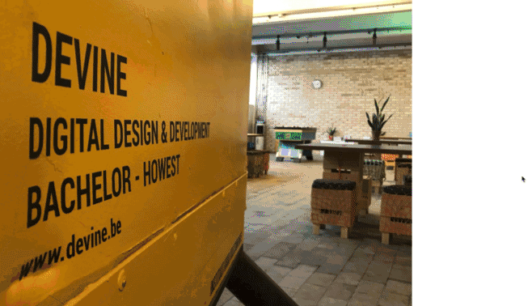
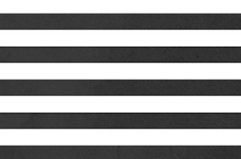
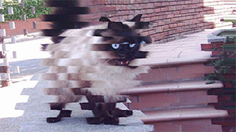
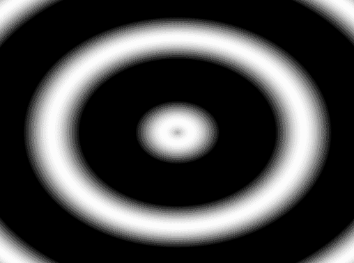
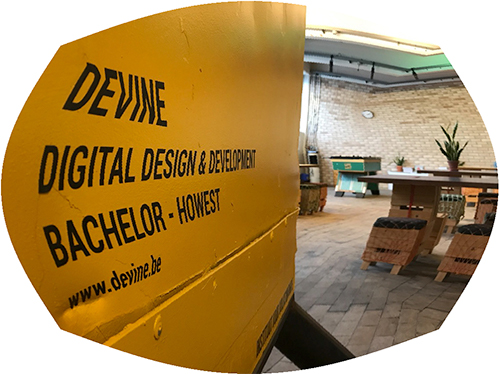
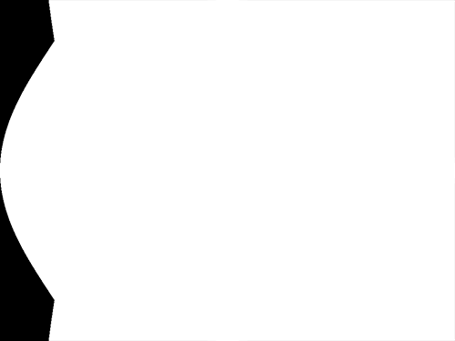
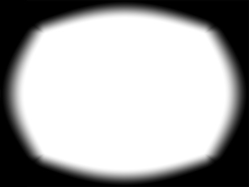
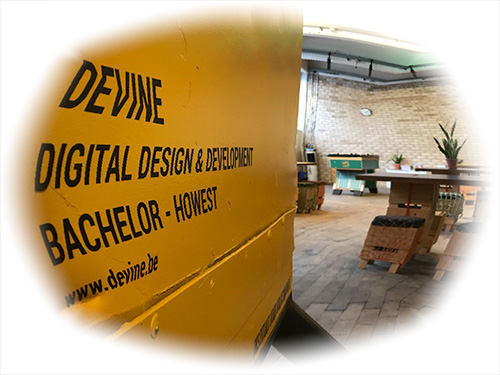
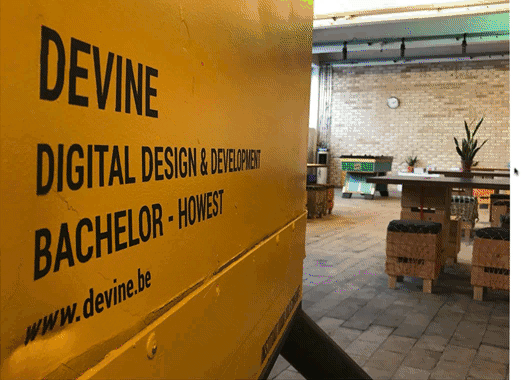

# Week 2 - WebGL

WebGL is a rasterization engine, enabling you to use the raw power of your GPU from javascript. It's mostly used to render pixels to an HTML canvas, and opens up the possibility to do 3D graphics rendering using web technologies.

# WebGL 2D - Fragment Shaders

__We've prepared a video series going through the basics of WebGL, vertex and fragment shaders. You can find the instructional videos on our learning platform. All exercices from this WebGL 2D chapter are available as step-by-step instructional videos.__

The solutions for these exercices are in [the week02/2d folder](2d) of this repo.

You need to load these html files through http. An easy way to do this, is by adding [the live server plugin](https://marketplace.visualstudio.com/items?itemName=ritwickdey.LiveServer) to your VSCode install, and right-clicking on the html file:


__Note: we've chosen to write all javascript in the html files themselves. While for projects, you might want to use a webpack stack, this is overkill for the quick demo and prototyping approach we're taking in this course.__

Read through the following chapters in WebGL Fundamentals before continuing:

- [Fundamentals](https://webglfundamentals.org/webgl/lessons/webgl-fundamentals.html)
- [Textures](https://webglfundamentals.org/webgl/lessons/webgl-3d-textures.html)

## Showing an image

Open up [02-image.html](2d/02-image.html) in VSCode and go through the code.

You'll notice a couple of things:

```javascript
const createShader = (gl, type, source) => {
  const shader = gl.createShader(type);
  gl.shaderSource(shader, source);
  gl.compileShader(shader);
  const success = gl.getShaderParameter(shader, gl.COMPILE_STATUS);
  if (success) {
    return shader;
  }
  console.error(gl.getShaderInfoLog(shader));
  gl.deleteShader(shader);
};
```

This function receives a gl context, a type (will be `gl.VERTEX_SHADER` or `gl.FRAGMENT_SHADER`) and a string containing the GLSL source code for the shader. It returns a compiled shader.

```javascript
const createProgram = (gl, vertexShader, fragmentShader) => {
  const program = gl.createProgram();
  gl.attachShader(program, vertexShader);
  gl.attachShader(program, fragmentShader);
  gl.linkProgram(program);
  const success = gl.getProgramParameter(program, gl.LINK_STATUS);
  if (success) {
    return program;
  }
  console.error(gl.getProgramInfoLog(program));
  gl.deleteProgram(program);
};
```

This function receives a gl context, a vertext shader instance and a fragment shader instance (created with `createShader`).

```javascript
const gl = canvas.getContext('webgl');
```

We're getting the context from the canvas as a webgl context. You might have used `2d` contexts before, which would run on the CPU. WebGL contexts will work with shader programs, on the GPU.

```glsl
const vertexShader = createShader(gl, gl.VERTEX_SHADER, `
precision mediump float;

attribute vec2 a_position;
attribute vec2 a_texCoord;

varying vec2 uv;

void main() {     
  gl_Position = vec4(a_position, 1, 1);
  uv = a_texCoord;
}
`);
```

This block compiles a GLSL string to a vertext shader using the createShader function mentioned earlier. A couple of things in there are:

- `attribute vec2 a_position`: an attribute buffer of type vec2 (2d vector). We will provide an array with coordinates as an input, this position is used to calculate the vertex positions on the screen ([clip space - see webglfundamental](https://webglfundamentals.org/webgl/lessons/webgl-fundamentals.html#webgl-hello-world))
- `attribute vec2 a_texCoord`: an attribute which will specify where we sample a color from the texture. It is specified as 2d vectors in uv-coordinate space (values between 0 and 1).
- `varying vec2 uv`: a "varying" type - this is a way to pass values from the vertex shader to the fragment shader. Note that we're setting the value of uv to be the same as the a_texCoord attribute.
- `main()`: this method us run automatically for each pixel when executing the shader.
- `gl_Position`: set this variable to a 4d coordinate (x, y, z, w). As we will be handing 2D logic at first, z and w will be set to 1.

```glsl
const fragmentShader = createShader(gl, gl.FRAGMENT_SHADER, `
precision mediump float;

uniform sampler2D texture;

varying vec2 uv;

void main() {
  gl_FragColor = texture2D(texture, uv);
}
`);
```

Same, but now it's compiling the fragment shader code. A fragment shader is used to determine the target pixel color.

- `uniform sampler2D texture`: the pixels to use as input. In this chapter we will be using images (or videos) as input.
- `varying vec2 uv`: a 2d vector, passed in from our vertex shader.
- `main()`: this method us run automatically for each pixel when executing the shader.
- `gl_FragColor`: the target pixel color as a 4d vector (r,g,b,a). In this example we're just taking the color of the pixel in the texture.

```javascript
const positionAttributeLocation = gl.getAttribLocation(program, "a_position");
const positionBuffer = gl.createBuffer();
```

Get a javascript reference to the `a_position` attribute in the webgl program. Also create a new empty gl buffer. We will be setting this buffer to a value later. There's a similar block for the `a_texCoord` buffer as well.

```javascript
gl.useProgram(program);
```

Tell our webgl context to use the program in the `program` variable. You could have multiple programs in your app.

```javascript
gl.bindBuffer(gl.ARRAY_BUFFER, positionBuffer);
gl.bufferData(
  gl.ARRAY_BUFFER,
  new Float32Array([
      -1.0, 1.0,
      1.0, 1.0,
      -1.0, -1.0,

      -1.0, -1.0,
      1.0, 1.0,
      1.0, -1.0
  ]),
  gl.STATIC_DRAW);
gl.enableVertexAttribArray(positionAttributeLocation);
gl.vertexAttribPointer(positionAttributeLocation, 2, gl.FLOAT, false, 0, 0);
```

Fill the gl buffer with array values, and pass it on in to the attribute. Check [the docs on vertexAttribPointer](https://developer.mozilla.org/en-US/docs/Web/API/WebGLRenderingContext/vertexAttribPointer) for more info on the parameters.

```javascript
const drawScene = () => {
  gl.viewport(0, 0, gl.canvas.width, gl.canvas.height);
  gl.clearColor(0, 0, 0, 0);
  gl.clear(gl.COLOR_BUFFER_BIT);
  gl.useProgram(program);

  gl.drawArrays(gl.TRIANGLES, 0, 6);

  requestAnimationFrame(drawScene);
};
```

This is our render loop, executed on `requestAnimationFrame`. Here we're clearing the canvas and render 2 triangles on the screen. A triangle consists of 3 points. Two times 3 is 6. If we line up the triangles (which happened in the assignment of the position buffer) we draw a rectangle.

__Note: this is a lot of boilerplate code to show an image on the screen. Most of our work during this chapter will be happening in the fragment shader code and providing our fragment shader with extra inputs (uniforms).__

## Basic color adjustments

The most important job of the fragment shader is providing a 4d color vector to `gl_FragColor`. In the show image boilerplate code, we sample a color from a texture and pass that unmodified color to the `gl_FragColor`.

You can do basic image color manipulation, by modifying the value of that sampled color.

For example: you could set the red component to full red:

```glsl
void main() {
  vec4 sampleColor = texture2D(texture, uv);
  sampleColor.r = 1.0;
  gl_FragColor = sampleColor;
}
```

You should see an image with the red channel boosted to max:



Go through the post [Colour correction with webgl](https://timseverien.com/posts/2020-06-19-colour-correction-with-webgl/) until you reach Colour Matrices. We will cover that a bit later.

### Interactive colour correction

Let's make the amount of brightness, contrast and / or saturation interactive. You can pass values to the webgl shader by providing uniform values.

Define a new uniform float in the top section of your fragment shader:

```glsl
uniform float effectFactor;
```

Use that uniform value as the value for your effect, e.g. brightness adjustment function:

```glsl
sampleColor.rgb = adjustBrightness(sampleColor.rgb, effectFactor);
```

In the global scope of your javascript code, you'll lookup this uniform reference in the program and you'll define a variable as well where you'll store the real javascript value:

```javascript
const effectFactorLocation = gl.getUniformLocation(program, "effectFactor");
let effectFactor = 0;
```

In the `init()` function, you'll listen for mouse move events, and calculate a value between -1 and 1 depending on the horizontal mouse position.

```javascript
canvas.addEventListener('mousemove', (e) => {
  // TODO!!
  // check the e object to determine which property you can use for the x position
  // map this to a range between -1 and 1 (we've provided a map function)
  // set the effectFactor variable
});
```

In our `drawScene()` loop, we can pass this uniform to the shader, before we call into drawArrays:

```javascript
gl.uniform1f(effectFactorLocation, effectFactor);
```

You should end up with something like this:


### Color Matrix

Next up, we're going to be using color matrices as a more flexible way of modifying our target color. Each of our filters is currently a multiplication and / or addition of a vector with our original color. By using matrices, we can get rid of the separate formulas in our shader, and use a matrix input which will contain the multiplication and / or sum factors.

Continue [Tim Severien's post on colour correction](https://timseverien.com/posts/2020-06-19-colour-correction-with-webgl/) with the matrix manipulation part. Wait with the filter part for now.

Build a simple slider ui, so you can modify brightness, contrast, exposure and saturation from your javascript code.

Beware: your matrices will need to be transposed when multiplying them. Here's a transpose function you could use for this:

```javascript
const transpose = (out, a) => {
  // If we are transposing ourselves we can skip a few steps but have to cache some values
  if (out === a) {
    let a01 = a[1],
        a02 = a[2],
        a03 = a[3];
    let a12 = a[6],
        a13 = a[7];
    let a23 = a[11];

    out[1] = a[4];
    out[2] = a[8];
    out[3] = a[12];
    out[4] = a01;
    out[6] = a[9];
    out[7] = a[13];
    out[8] = a02;
    out[9] = a12;
    out[11] = a[14];
    out[12] = a03;
    out[13] = a13;
    out[14] = a23;
  } else {
    out[0] = a[0];
    out[1] = a[4];
    out[2] = a[8];
    out[3] = a[12];
    out[4] = a[1];
    out[5] = a[5];
    out[6] = a[9];
    out[7] = a[13];
    out[8] = a[2];
    out[9] = a[6];
    out[10] = a[10];
    out[11] = a[14];
    out[12] = a[3];
    out[13] = a[7];
    out[14] = a[11];
    out[15] = a[15];
  }
  return out;
}
```

For example: when setting the values in the saturation array, you'll transpose them:

```javascript
transpose(u_saturationMatrix, [
  sr + s, sg    , sb    , 0,
  sr    , sg + s, sb    , 0,
  sr    , sg    , sb + s, 0,
  0     , 0     , 0     , 1,
]);
```

Otherwise you'll end up with weird colors, especially with the saturation factors 🌈.

You can [check out the solution](2d/04a-color-matrix.html) when you're stuck.


### Precalculate matrices

Right now, we're doing our matrix multiplication per pixel in our shader. We've got a matrix per effect (brightness, contrast, exposure and saturation), so this approach has some overhead (the same resulting matrix with the effect is calculated for each pixel).

We can calculate the effect matrix (eg brightess x contrast x exposure x saturation) once in our javascript code, and send in that effect matrix. This way, our shader will have a bit less work.

Change the fragment shader, so it receives one matrix and offset instead, and uses these to change the pixel color:

```diff
precision mediump float;

uniform sampler2D texture;

- uniform mat4 u_brightnessMatrix;
- uniform vec4 u_brightnessOffset;
- uniform mat4 u_contrastMatrix;
- uniform vec4 u_contrastOffset;
- uniform mat4 u_exposureMatrix;
- uniform vec4 u_exposureOffset;
- uniform mat4 u_saturationMatrix;
- uniform vec4 u_saturationOffset;

+ uniform mat4 matrix;
+ uniform vec4 offset;

varying vec2 uv;

void main() {
  vec4 texel = texture2D(texture, uv);
-  mat4 matrix = u_brightnessMatrix * u_contrastMatrix * u_exposureMatrix * u_saturationMatrix;
-  vec4 offset = u_brightnessOffset + u_contrastOffset + u_exposureOffset + u_saturationOffset;

  gl_FragColor = matrix * texel + offset;
}
```

[Download gl-matrix](http://glmatrix.net) and extract it in your project folder.

Import vec4 and mat4 from gl-matrix in your javascript code. Note: you'll need to set the script type to module in order to do this:

```html
<script type="module">
    import * as mat4 from "./js/gl-matrix/mat4.js";
    import * as vec4 from "./js/gl-matrix/vec4.js";

    const createShader = (gl, type, source) => {
    
    // etc...
```

Add a general matrix and offset, which will store the multiplications and sums of all these matrices and offsets:

```javascript
const matrix = mat4.create();
const offset = vec4.create();
```

These create methods just create regular arrays. You can modify the matrices and offsets you've already got for the effect to use these create methods, or just leave them as they are right now.

We'll no longer need the uniform locations to the separate effects, but will need uniform locations for the general matrix and offset:

```diff
- const u_brightnessMatrixLocation = gl.getUniformLocation(program, "u_brightnessMatrix");
- const u_brightnessOffsetLocation = gl.getUniformLocation(program, "u_brightnessOffset");

- const u_contrastMatrixLocation = gl.getUniformLocation(program, "u_contrastMatrix");
- const u_contrastOffsetLocation = gl.getUniformLocation(program, "u_contrastOffset");

- const u_exposureMatrixLocation = gl.getUniformLocation(program, "u_exposureMatrix");
- const u_exposureOffsetLocation = gl.getUniformLocation(program, "u_exposureOffset");

- const u_saturationMatrixLocation = gl.getUniformLocation(program, "u_saturationMatrix");
- const u_saturationOffsetLocation = gl.getUniformLocation(program, "u_saturationOffset");

+ const matrixLocation = gl.getUniformLocation(program, "matrix");
+ const offsetLocation = gl.getUniformLocation(program, "offset");
```

Finally, you'll be doing the matrix calculations in your draw loop:

```javascript
mat4.identity(matrix);
mat4.multiply(matrix, matrix, u_brightnessMatrix);
mat4.multiply(matrix, matrix, u_contrastMatrix);
mat4.multiply(matrix, matrix, u_exposureMatrix);
const saturationTransposed = mat4.create();
mat4.transpose(saturationTransposed, u_saturationMatrix);
mat4.multiply(matrix, matrix, saturationTransposed);

vec4.zero(offset);
vec4.add(offset, offset, u_brightnessOffset);
vec4.add(offset, offset, u_contrastOffset);
vec4.add(offset, offset, u_exposureOffset);
vec4.add(offset, offset, u_saturationOffset);

gl.uniformMatrix4fv(matrixLocation, false, matrix);
gl.uniform4fv(offsetLocation, offset);
```

Test your app, the result should be the same as previous, but the improvement 

### Effects

Continue with [the post on colour corrections](https://timseverien.com/posts/2020-06-19-colour-correction-with-webgl/) and implement the effects part. The big difference is you'll be using precalculated matrices instead of having a separate effect matrix.

You can find a couple of [effect matrices in the Doka documentation](https://pqina.nl/doka/docs/patterns/api/doka-instance/#setting-filters).

As a final exercise, we'll animate between our regular colors and the effect colors:



There's a builtin function in GLSL to interpolate between values: [the mix function](https://thebookofshaders.com/glossary/?search=mix).

First of all, we'll prepare our fragment shader. Add an extra uniform `effectFactor`:

```glsl
uniform float effectFactor;
```

This effectFactor will be a value between 0 and 1. 0 will be: use the original color, 1 will be: use the modified effect color. Values between that should interpolate between those 2 colors:

```glsl
void main() {
  vec4 sampleColor = texture2D(texture, uv);
  vec4 filteredColor = matrix * sampleColor + offset;
  gl_FragColor = mix(sampleColor, filteredColor, effectFactor);
}
```

Create a global effectFactor variable and get a reference to it's uniform location. Add listeners to mouseover and mouseout to set that variable (we won't do animation in this first iteration):

```javascript
canvas.addEventListener('mouseover', e => {
  effectFactor = 1;
});

canvas.addEventListener('mouseout', e => {
  effectFactor = 0;
});
```

In the draw loop, you'll pass this effectFactor into the shader:

```javascript
gl.uniform1f(effectFactorLocation, effectFactor);
```

You should see the colors switch on hover.

### Animated effect

To animate our effectFactor, we'll use [the GSAP animation library](https://greensock.com/docs/v3/Eases).

Add a script tag before your own script tag to load it from a CDN:

```html
<script src="https://cdnjs.cloudflare.com/ajax/libs/gsap/3.5.1/gsap.min.js" integrity="sha512-IQLehpLoVS4fNzl7IfH8Iowfm5+RiMGtHykgZJl9AWMgqx0AmJ6cRWcB+GaGVtIsnC4voMfm8f2vwtY+6oPjpQ==" crossorigin="anonymous"></script>
```

If you take a look at [the GSAP docs](https://greensock.com/docs/v3/Eases), you'll notice that GSAP works by modifying object properties. You can't animate a regular variable.

Modify the effectFactor definition to wrap it inside of an object:

```javascript
const properties = {
  effectFactor: 0
};
```

In the mouse events, you'll animate this property:

```javascript
gsap.to(properties, { duration: 1, ease: "power4.out", effectFactor: 1});
```

Don't forget to modify the code where you're passing the effectFactor into the shader:

```javascript
gl.uniform1f(effectFactorLocation, properties.effectFactor);
```

## Kernels

Up until now, we've modified the color of a pixel with an operation which multiplies the original pixel with a matrix.

The next step is look at adjacent pixels, and take those color values into account as well. This way you can create effects such as edge detection (high contrast with adjacent pixel means there is an edge) and blur effects (calculate the color as an average color of adjacent pixels).

Work through the steps at [webgl image processing](https://webglfundamentals.org/webgl/lessons/webgl-image-processing.html), starting from the alinea _"What if we want to do image processing that actually looks at other pixels?"_.

## 2D Displacement maps

Another technique to modify pixel colors is through displacement maps. Instead of using a matrix or a buffer as an input modifyer, you can use a second texture as a data source. You can use the color value of this second texture as a modification value for the sampled color of your main texture.

In the fragment shader, you'll have 2 images: the image itself and a displacement texture:

```glsl
uniform sampler2D texture;
uniform sampler2D disp;
```

The sampling position gets influenced by the red channel of the displacement texture:

```glsl
float effectFactor = 0.05;
vec2 distortedPosition = vec2(uv.x + disp.r * effectFactor, uv.y);
gl_FragColor = texture2D(texture, distortedPosition);
```

Applying a black and white displacement map such as the one below:



Would result in the effect below:



Things get even more interesting when you start animating the displacement factor from the shader. You can animate the uniform value on hover, like we did in the previous project:

```javascript
canvas.addEventListener('mouseover', () => gsap.to(properties, { duration: 1, ease: "power4.out", effectFactor: 1}));
canvas.addEventListener('mouseout', () => gsap.to(properties, { duration: 1, ease: "power4.out", effectFactor: 0}));
```

On hover, you'll get the following effect:


Try implementing this displacement effect by yourself. There's a couple of displacement maps for you to test in the [2d/images/displacement](2d/images/displacement) folder.

### Displacement transition between images

You could also mix 2 images using this displacement value. To do so, you would add yet another texture, so you'd have 3:

- image 1
- image 2
- displacement map

In the fragment shader logic, you would calculate 2 displacement positions. One of them being the inverse-effect-position (by doing 1.0 minus the displacement factor):

```glsl
vec4 disp = texture2D(disp, uv);
vec2 distortedPosition = vec2(uv.x + dispFactor * (disp.r*effectFactor), uv.y);
vec2 distortedPosition2 = vec2(uv.x - (1.0 - dispFactor) * (disp.r*effectFactor), uv.y);
```

You would then use these two distortedPosition vectors to sample a color from each of the 2 images:

```glsl
vec4 _texture = texture2D(texture, distortedPosition);
vec4 _texture2 = texture2D(texture2, distortedPosition2);
```

And use the mix function to interpolate between the two:

```glsl
gl_FragColor = mix(_texture, _texture2, dispFactor);
```


## Ripple effect

Up until now, we've used textures as input for our origin image and displacement map. Using some creative math, you can also generate pixel colors yourself.

Restart from the basic show image project.

We'll create some concentric ovals, using just math. In your fragment shader, calculate the distance of the uv coordinate to the center uv:

```glsl
float distance = length(uv - vec2(0.5, 0.5));
```

Using a `sin` function, we can calculate the sine waveform from that distance. When multiplying this with a vec4 and setting that as the gl_FragColor you can visualize the results:

```glsl
vec4 disp = vec4(1.0, 1.0, 1.0, 1.0);
disp.rgb *= sin(distance);
gl_FragColor = disp;
```

You should see a fade from a black center to a grey border:


Our distance will be a value between 0 and 0.5, which is quite a small range for the sine function. If you multiply this value with a larger number, things become more interesting:

```glsl
disp.rgb *= sin(distance * 20.0);
```


We can animate these circles, by adding a "phase offset" to the sine calculation.

Define a new uniform float phase:

```glsl
uniform float phase;
```

And add this uniform value to the sine calculation:

```glsl
disp.rgb *= sin(distance * 20.0 + phase);
```

In your javascript, you'll need to reference this uniform, so store it's location in a global const:

```javascript
const phaseLocation = gl.getUniformLocation(program, "phase");
```

In the drawloop, we'll update this value. You can take advantage of the fact that requestAnimationFrame receives a timing offset in the function call. So change the signature of the drawScene to capture this time:

```javascript
const drawScene = (time = 0) => {
```

And pass it to the phase uniform, before doing drawArrays. Make sure to divide it by a factor, otherwise the circle will move too fast:

```javascript
gl.uniform1f(phaseLocation, time / 100);
```

You should see the circles moving:



We've now got an animating, black and white image... We can use this as an input for a displacement effect!

Take a look at the previous exercise, where you used a texture value as displacement factor (the single image, not the transition between images). Use our concentric circle as the displacement factor. You should have the following result:


As a final step, try adding hover interaction to the page, so the effect only triggers when hovering over the image.

## Warp effect

As a next exercise, we want to create a warp effect - as described at https://stackoverflow.com/questions/46857876/old-school-tv-edge-warping-effect

Start off from the [basic image example](2d/02-image.html). We're only interested in the warping effect, we'll ignore the horizontal stripes and color shift.

In the stackoverflow post you'll find the following block of shader code:

```glsl
vec2 ndc_pos = vertPos;
vec2 testVec = ndc_pos.xy / max(abs(ndc_pos.x), abs(ndc_pos.y));
float len = max(1.0,length( testVec ));
ndc_pos *= mix(1.0, mix(1.0,len,max(abs(ndc_pos.x), abs(ndc_pos.y))), u_distortion);
vec2 texCoord = vec2(ndc_pos.s, -ndc_pos.t) * 0.5 + 0.5;
```

In the shader code above, they're using the xy vertex position in the fragment shader. In order to access this, you can pass it as a varying from the vertex shader to the fragment shader.

Define the vertPos as a varying vec2 in __both__ your vertex and fragment shader:

```glsl
varying vec2 vertPos;
```

Set this vertPos at the end of the main() function of your __vertex__ shader:

```glsl
vertPos = gl_Position.xy;
```

You'll need a `uniform float u_distortion` in the fragement shader as well:

```glsl
uniform float u_distortion;
```

Get this uniform location in your javascript code, and initialize it to a value of 1.0. You should see something like this:


If you take a closer look at the edges, you'll notice that the pixels are repeating (for example: look at the floor on the bottom right of the image). That's because our shader is sampling colors outside of the 0-1 uv coordinate space, and falls back to the last available pixel for the edge.

A quick approach is by adding a couple of if-statements and multiplying the color by 0 if the `texCoord` falls outside of our 0-1 range:

```glsl
vec4 sampleColor = texture2D(texture, texCoord);

if (texCoord.x < 0.0) {
  sampleColor *= 0.0;
}

gl_FragColor = sampleColor;
```

Write the 3 other statements checking if x and y are between 0 and 1. You should see the following result:



We're kind of there... but not quite yet. You'll see some heavy aliasing at the edges.


This is happening because we straight going from a full color to none. We can get rid of this by using a slight "gradient" at the edges.

To make coding a little easier, we'll make our mask visible instead of the resulting image. Replace your previous if/else logic, with the following:

```glsl
float mask = 1.0;

if (texCoord.x < 0.0) {
  mask = 0.0;
}
if (texCoord.x > 1.0) {
  mask = 0.0;
}
if (texCoord.y < 0.0) {
  mask = 0.0;
}
if (texCoord.y > 1.0) {
  mask = 0.0;
}

vec4 maskPreview = vec4(mask, mask, mask, 1.0);

gl_FragColor = maskPreview;
```


An alternative approach to using if/else statements, is using [the glsl step function](https://thebookofshaders.com/glossary/?search=step). This function takes 2 parameters: an edge (threshold value) and a value. Read more about this at [https://thebookofshaders.com/glossary/?search=step](https://thebookofshaders.com/glossary/?search=step).

Replace the if/else statements, with the following step function call

```glsl
float mask = 1.0;
mask *= step(0.0, texCoord.x);
```

This should give you the result below:



Try figuring out the other 3 step function calls, so you get the same mask as before:


You can [take a peek at the solution](2d/08d-warp-mask-step.html) if you're stuck.

Ok, we're back to an aliased mask... but what we want is a small gradient at the edges. This is where [smoothstep](https://thebookofshaders.com/glossary/?search=smoothstep) comes in. This function expects 3 parameters: 2 parameters describing your threshold space (min and max threshold) and a value. It will create a smooth interpolation for values within the threshold space. Read more about this at [https://thebookofshaders.com/glossary/?search=smoothstep](https://thebookofshaders.com/glossary/?search=smoothstep).

Try implementing this smoothstep yourself, and aim for the following result:



As always, there's a [solution of the current state](2d/08e-warp-mask-smoothstep.html) available.

If you'd apply the calculate mask float with the sampleColor

```glsl
gl_FragColor = sampleColor * mask;
```

you'd get a masked version of the image:



We're almost there! Try making the gradient space as small as possible (find the sweet spot between having a small gradient and an aliased edge). See if you can get the warp activate on hover, so you get the following effect:



# WebGL 3D - Three.js

Survived the WebGL 2D part? Let's add the 3rd dimension to our apps!

Doing 2D WebGL might have seemed a lot of work already, and things get a bit more complicated when we start adding the 3rd dimension. This is why we'll use [Three.js](https://threejs.org/) to abstract some of the math and shader stuff.

Three.js itself has some great [documentation](https://threejs.org/docs/index.html#manual/en/introduction/Creating-a-scene) and [an extensive list of examples](https://threejs.org/examples/).

To learn how to work with Three.js, we are going to go with the lesson series at https://threejsfundamentals.org/. We'll go through some of the pages there, before creating an interactive 3D WebGL experience.

## Hello Three.js

To be able to run of the Thee.js code, you'll need to link the Three.js library. Just use the CDN for now. And, as you're just experimenting and learning right now, you don't really need to go through the trouble of settings up a bundler / transpiler. Set your script tag as "module" and import threejs.module.js from either a CDN or a local download:

```javascript
<script type="module">
  import * as THREE from 'https://cdnjs.cloudflare.com/ajax/libs/three.js/r120/three.module.js';
</script>
```

You'll start by going through the page at https://threejsfundamentals.org/threejs/lessons/threejs-fundamentals.html where you'll build a basic Three.js scene, familiarizing yourself with some basic Three.js concepts.

Work your way through the following lessons:

- https://threejsfundamentals.org/threejs/lessons/threejs-responsive.html
- https://threejsfundamentals.org/threejs/lessons/threejs-primitives.html
- https://threejsfundamentals.org/threejs/lessons/threejs-scenegraph.html

Read up on materials at https://threejsfundamentals.org/threejs/lessons/threejs-materials.html

And continue coding with:

- https://threejsfundamentals.org/threejs/lessons/threejs-textures.html (up until Filtering and Mips)

After handling the basics of textures, read through the following pages, and check the live demos. No need to code these yourself, just get yourself familiar with the different types and options:

- https://threejsfundamentals.org/threejs/lessons/threejs-lights.html
- https://threejsfundamentals.org/threejs/lessons/threejs-cameras.html
- https://threejsfundamentals.org/threejs/lessons/threejs-shadows.html

## The Aviator

A fun tutorial, applying a lot of the content covered before, can be found at https://tympanus.net/codrops/2016/04/26/the-aviator-animating-basic-3d-scene-threejs/ - go through the tutorial, and try implementing it using ES6 code.


# Where to go from here

- http://math.hws.edu/graphicsbook/index.html
- https://github.com/sjfricke/awesome-webgl
- https://thebookofshaders.com/
- https://www.august.com.au/blog/animating-scenes-with-webgl-three-js
- https://tympanus.net/codrops/2017/05/09/infinite-tubes-with-three-js/
