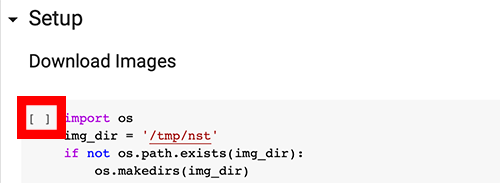
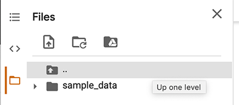
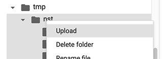

# Artificial Intelligence

## Videos

- Watch [Coding Train - What is Machine Learning (first 16 min)](https://www.youtube.com/watch?v=LvIa0-ZKCrc&list=PLRqwX-V7Uu6bCN8LKrcMa6zF4FPtXyXYj)
- Watch [Sónar+D Masterclasses 2019: The Limits of Learning, with Kyle McDonald](https://www.youtube.com/watch?v=kWvHjp8vifM)

## Intro

The last decade there's been a lot of buzz around Machine Learning, Artificial Intelligence and Deep learning. The explosion in computer performance, especially with GPUs has enabled new possibilities in making computers seem intelligent.

You'll see the terms Artificial Intelligence, Machine Learning and Deep Learning getting mixed together a lot. They're actually a subset of eachother:

Artificial Intelligence contains Machine Learning, which contains Deep Learning:

Image Source: https://blogs.nvidia.com/blog/2016/07/29/whats-difference-artificial-intelligence-machine-learning-deep-learning-ai/ 

Using Machine Learning, you can make a computer do things, without explicitly programming that task. There are roughly 3 types of tasks which can be executed using Machine Learning:

1. Classification: Label data, based on certain inputs. An example would be OCR: given an image of a letter, predicting which letter it is.
2. Regression: Calculating a single value based on a number of inputs. For example: calculating the price of a house, based on data such as number of bedrooms, square meters, neighbourhood, ...
3. Clustering: Group data together. In contrast with Classification, the groups / labels are not known in advance. An example is analyzing customer behaviour (customers also bought...)

Training the algorithm can happen in different ways:

1. Supervised Learning: An algorithm learns, based on example input data with the correct answers. For example: we give the computer a list of housing data with corresponding prices. Or a list of images of letters, with the corresponding letter label. (this is a letter A, this is a letter B, ...)
2. Unsupervised Learning: The algorithm learns by itself, based on input data. Used mostly with clustering tasks.
3. Reinforcement Learning: The algorithm gets a reward when it performs well, and gets punished when it performs badly. Example would be learning to play a game automatically.

## Neural Networks

A Neural Network is built with different layers of "neurons", who are all connected to eachother. Every connection has a "weight", which affects the influence of a given neuron.

Image Credit: http://cs231n.github.io/neural-networks-1/

A non-trained network will have random weights and won't give you good results. By training a network with example data, you'll tweak the weights little by little, until our network (hopefully) performs well.

## GAN

A Generative Adversial Network (GAN) is a network with two competing entities: a Generator and a Discriminator. The Generator generate samples as real as possible, and tries to fool the Discriminator, who tries to classify between real and fake data.

Image Credit: https://www.freecodecamp.org/news/an-intuitive-introduction-to-generative-adversarial-networks-gans-7a2264a81394/

A popular example of a GAN is https://thispersondoesnotexist.com/ - each time you visit the page, you'll see a photo of a person, entirely generated by a GAN (StyleGAN). Or try detecting which person is real and which person is generated at http://www.whichfaceisreal.com.

# Exploring some models: Google Colab

A lot of the more recent AI models require a beefy nvidia GPU to run. You might not have a GPU that meets that requirement. Luckely, there are cloud options available to run these models on a remote server.

One of the free options to do so is Google Colab. You can create and run Python notebooks from the browser, executing the code on Google's powerful servers.

A good starting point for finding Google Colab notebooks is http://research.google.com/seedbank

## Neural Style Transfer with tf.keras

As a first exploration, we'll run a Style Transfer model. A Style Transfer model applies the "style" of one component to another component. This can be images, but could also be sound (e.g. music).

Do a search for "Neural Style" on https://research.google.com/seedback. You'll find a couple of notebooks. We'll work with the ["Neural Style Transfer with tf.keras" notebook](https://aihub.cloud.google.com/u/0/p/products%2F7f7495dd-6f66-4f8a-8c30-15f211ad6957). Click on the notebook in the search results. On the resulting page, you should find a [Run in Google Colab](https://colab.research.google.com/github/tensorflow/models/blob/master/research/nst_blogpost/4_Neural_Style_Transfer_with_Eager_Execution.ipynb) link. Click it to open the notebook in Google Colab.

A Colab notebook is a combination of text and code block. Read through the notebook and, whenever you encounter a code block, run it by clicking on the "play" icon (visible on hover over the square brackets:)

Wait for a block to finish executing before running the next one.

Some blocks finish fast (such as a function definition block), others might take a couple of minutes to finish (such as the blocks calling into `run_style_transfer`). Once a block finished, you'll see a number inside the square brackets (or a play icon if that block is still active):

Note: some blocks can take quite a while to run! Be patient 🙂. Go through the notebook up until "Try it on other images"

### Try it on other images

In the "Try it on other images" section you can see a couple of code blocks loading an image and style image. Let's try using an image of our own.

In the left section of your screen, you'll find a "folder" icon to go to the file explorer. Open the file explorer and click on the two dots to navigate one level up:

Navigate to /tmp/nst and rightclick that nst folder. Choose upload and upload a photo of your own:

Change one of the example blocks and try stylizing an image of your own!

